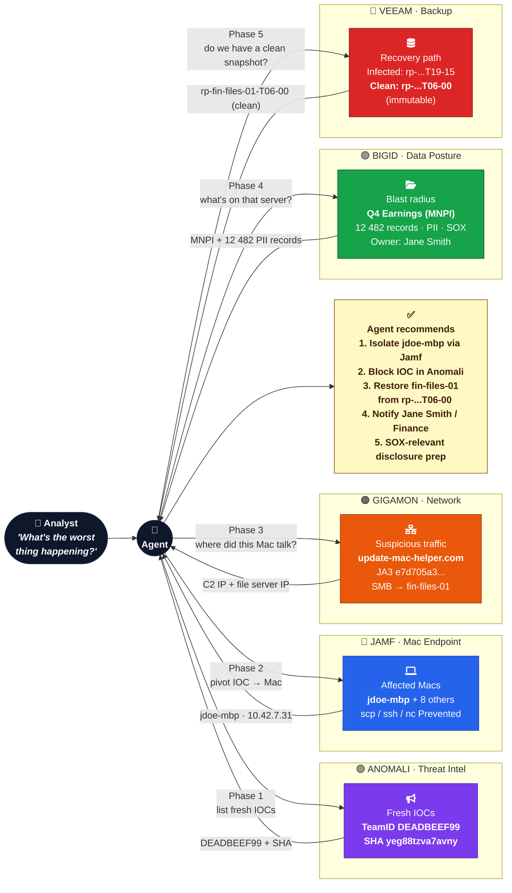
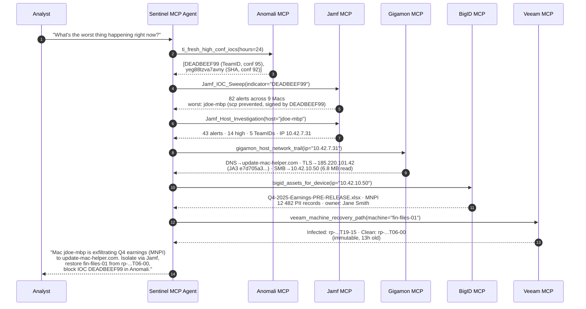

# Flow diagram — agentic SOC chain across 5 Sentinel ISV partners

This is the visual story behind the demo. One analyst prompt fires off a chain of MCP tool calls that walks across all 5 partners, each one feeding the next with concrete evidence (IOC values, hostnames, IPs, asset paths, restore-point IDs).

## High-level flow

## Tool-call sequence

## Why this is a good demo (for engineers)

- **One prompt, six vendors, zero tool-switching by the human.** This is the MCP value prop made visible.
- **Real data correlation, not hand-waving.** Same IP/hostname/IOC literally appears in 5 different Sentinel tables — the joins are real KQL, not narrative-only.
- **Reason codes propagate.** Each tool returns a `WhyFlagged` / `RiskHints` / `FlowReason` / `ExposureReason` / `RecoveryReason` array that the next tool (and the LLM) can quote verbatim without re-deriving the logic.
- **It's the Microsoft Security pitch via partner tools** — protect (Jamf), detect (Anomali/Jamf), respond (Gigamon/BigID), recover (Veeam) — all through MCP, not Microsoft slides.
